# 🚀 Mission Control AI — ConnectSat

Sistema inteligente de monitoramento e análise operacional de satélites para conectividade rural utilizando Inteligência Artificial Generativa.

Desenvolvido para a Global Solution 2026.1 da FIAP na trilha ConnectSat.

<br>

# 👥 Integrantes

* Guilherme Vinciguerra Carvalho — RM: 571951 — Turma: 1CCPI
* Marcos Peterson Martins Pereira — RM: XXXXXX — Turma: 1CCPI
* Matheus Jorge Santana — RM: 574166 — Turma: 1CCPI

<br>

# 📖 O que o projeto faz

O Mission Control AI simula o monitoramento de um satélite responsável por fornecer conectividade para regiões rurais.

O sistema coleta dados de telemetria, identifica alertas operacionais automaticamente e utiliza Inteligência Artificial Generativa para produzir análises técnicas sobre o estado da missão.

Além da análise do ciclo atual, o sistema mantém um histórico dos últimos ciclos operacionais, permitindo que a IA identifique tendências de degradação ou melhoria dos indicadores monitorados.

<br>

# 🎯 Persona atendida

## Operador de Satélite

O sistema foi projetado para apoiar operadores responsáveis pelo monitoramento de satélites de telecomunicações.

A IA atua como um assistente operacional, auxiliando na identificação de riscos, análise de alertas, tomada de decisão e avaliação dos impactos causados por falhas técnicas na população atendida.

<br>

# 🛠 Tecnologias utilizadas

* Python 3.10+
* Ollama Cloud API
* Modelo gpt-oss:120b
* Rich
* Prompt Toolkit
* PyFiglet
* Python Dotenv

### Bibliotecas principais

```bash
ollama
python-dotenv
rich
prompt-toolkit
pyfiglet
```

<br>

# ✨ Funcionalidades

* Coleta de telemetria simulada
* Sistema automático de alertas
* Respostas automáticas para situações críticas
* Análise operacional por IA generativa
* Histórico dos últimos ciclos monitorados
* Identificação de tendências temporais
* Interface visual em terminal utilizando Rich
* Cenários de demonstração controlados para testes

<br>

# 🧠 Diferenciais Implementados

## Few-Shot Prompting

O prompt principal contém exemplos completos de entrada e saída para orientar o comportamento da IA.

## Memória de Contexto

Os últimos ciclos de telemetria são armazenados e enviados ao modelo para análise temporal.

A IA consegue identificar:

* Crescimento de latência
* Queda de throughput
* Aumento de temperatura
* Degradação da antena

## Interface Visual

Implementada utilizando Rich:

* Banner ASCII personalizado
* Tabelas de telemetria
* Barras de progresso
* Painéis de alertas
* Histórico visual dos ciclos

<br>

# 🚀 Como executar

## 1. Clone o repositório

```bash
git clone https://github.com/mathsant-js/Mission_Control_AI.git

cd Mission_Control_AI
```

## 2. Crie um ambiente virtual

Linux/Mac:

```bash
python -m venv .venv

source .venv/bin/activate
```

Windows:

```bash
python -m venv .venv

.venv\Scripts\activate
```

## 3. Instale as dependências

```bash
pip install -r requirements.txt
```

## 4. Configure a API Key

Crie um arquivo `.env` na raiz do projeto:

```env
OLLAMA_API_KEY=sua_chave_aqui
```

## 5. Execute a aplicação

```bash
python main.py
```

<br>

# 💻 Comandos disponíveis

| Comando    | Descrição                   |
| ---------- | --------------------------- |
| `/help`    | Lista de comandos           |
| `/status`  | Exibe telemetria atual      |
| `/history` | Mostra histórico dos ciclos |
| `/about`   | Informações sobre o projeto |
| `/clear`   | Limpa a tela                |
| `/exit`    | Encerra a aplicação         |

<br>

# 📁 Estrutura do Projeto

```text
Mission_Control_AI/
│
├── assets/
│   ├── screenshot_analise_parte1.png
|   ├── screenshot_analise_parte1.png
|   └── screenshot.png
|
├── data/
│   └── cenarios.json
│
├── prompts/
│   └── system_prompt.md
│
├── src/
│   ├── alertas.py
│   ├── engine.py
│   ├── telemetria.py
│   ├── ui.py
│   └── banner_ascii.py
│
├── main.py
├── requirements.txt
├── .env.example
└── README.md
```

---

# 📸 Demonstração

### Tela Inicial

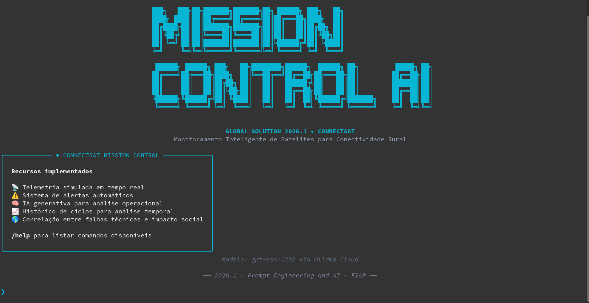

### Telemetria Operacional

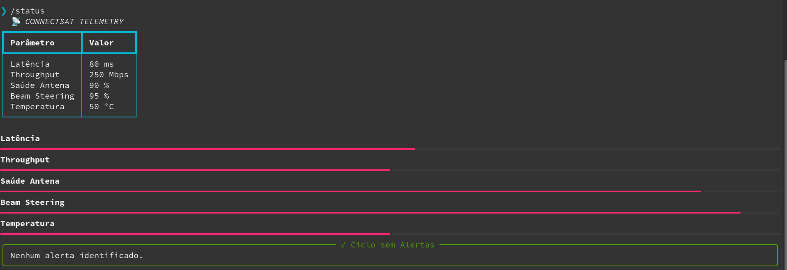

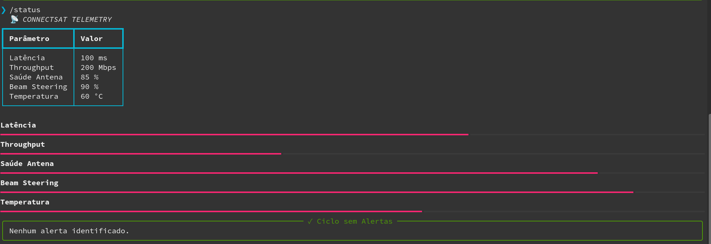

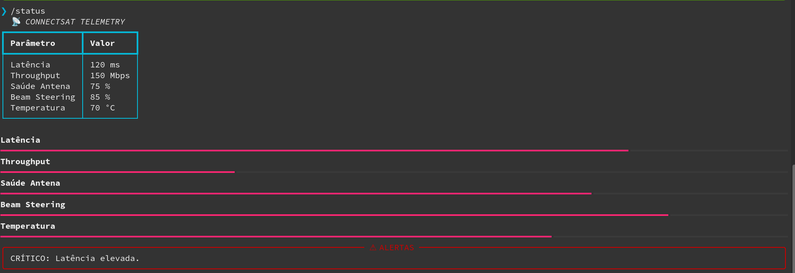

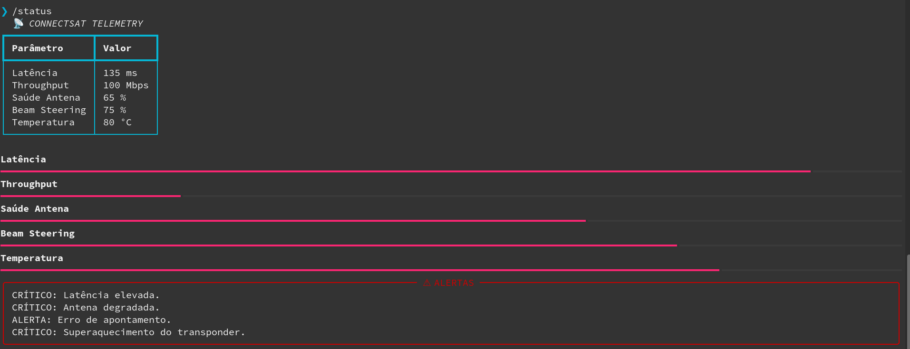

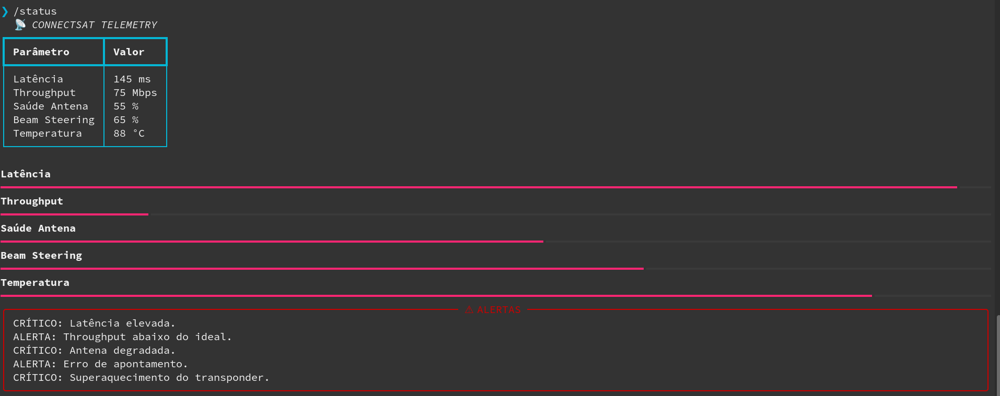

<br>

### Alerta Crítico

Exemplo de exibição de alerta crítico

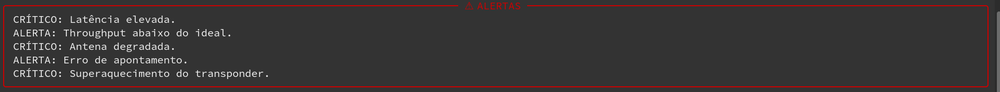

### Histórico dos Ciclos

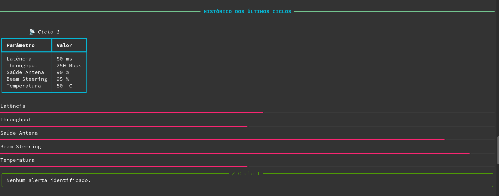
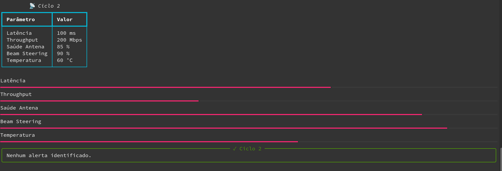
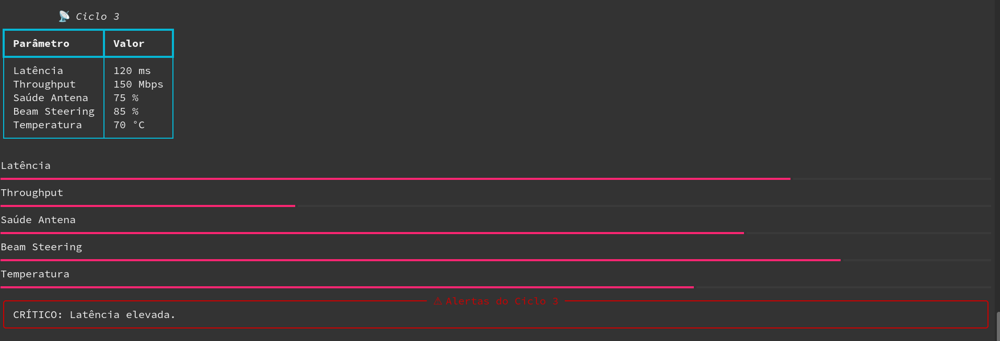
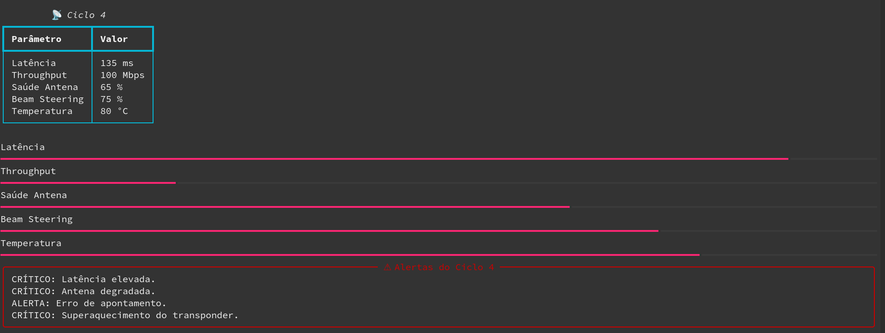
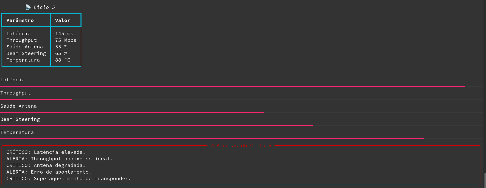


### Análise completa da missão

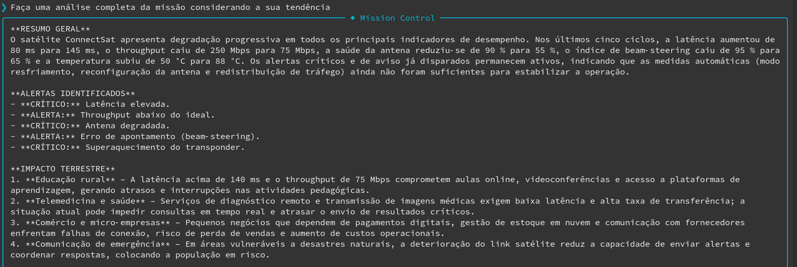
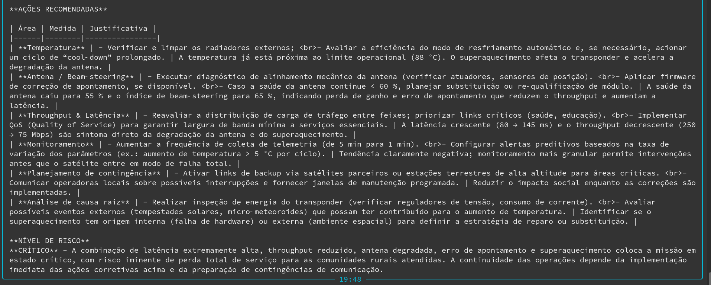

<br>

# 📄 System Prompt

O prompt principal utilizado pelo modelo está disponível em:

> [System Prompt](prompts/system_prompt.md)

<br>

# 🧪 Cenários de Teste Demonstrados

## 1. Operação Normal

* Latência dentro do esperado
* Throughput adequado
* Temperatura estável

Resultado esperado:

```text
Nível de risco: BAIXO
```

<br>

## 2. Latência Elevada

Condição:

```text
Latência > 100 ms
```

Resultado esperado:

```text
CRÍTICO: Latência elevada
```

<br>

## 3. Throughput Reduzido

Condição:

```text
Throughput < 100 Mbps
```

Resultado esperado:

```text
ALERTA: Throughput abaixo do ideal
```

<br>

## 4. Antena Degradada

Condição:

```text
Saúde da antena < 70%
```

Resultado esperado:

```text
CRÍTICO: Antena degradada
```

<br>

## 5. Superaquecimento

Condição:

```text
Temperatura > 75°C
```

Resultado esperado:

```text
CRÍTICO: Superaquecimento do transponder
```

<br>

## 6. Cenário Crítico Completo

Condições simultâneas:

* Alta latência
* Throughput reduzido
* Antena degradada
* Temperatura elevada

Resultado esperado:

```text
Nível de risco: CRÍTICO
```

<br>

## 7. Análise Temporal

Após múltiplos ciclos:

```text
/history
```

A IA identifica:

* Tendências de degradação
* Evolução dos alertas
* Crescimento contínuo da latência
* Queda progressiva de throughput
* Aumento da temperatura

<br>

# ⚠️ Limitações Conhecidas

* A telemetria é totalmente simulada.
* Não existe conexão com satélites reais.
* O sistema não executa ações reais sobre equipamentos.
* O histórico é armazenado apenas em memória.
* Não existe persistência em banco de dados.
* Não há autenticação de usuários.
* Não há integração com APIs espaciais ou meteorológicas.
* A classificação de risco depende da interpretação do modelo de IA.

<br>

# 🎥 Vídeo de Demonstração

🎥 Assistir no YouTube:

*Será adicionado...*

<br>

# 🎓 Projeto Acadêmico

Projeto desenvolvido para a disciplina de Prompt Engineering and AI.

Global Solution 2026.1 — FIAP

Trilha ConnectSat.